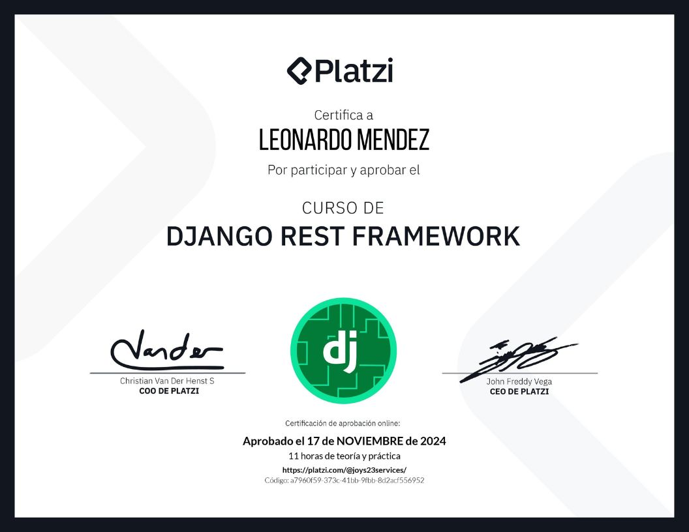
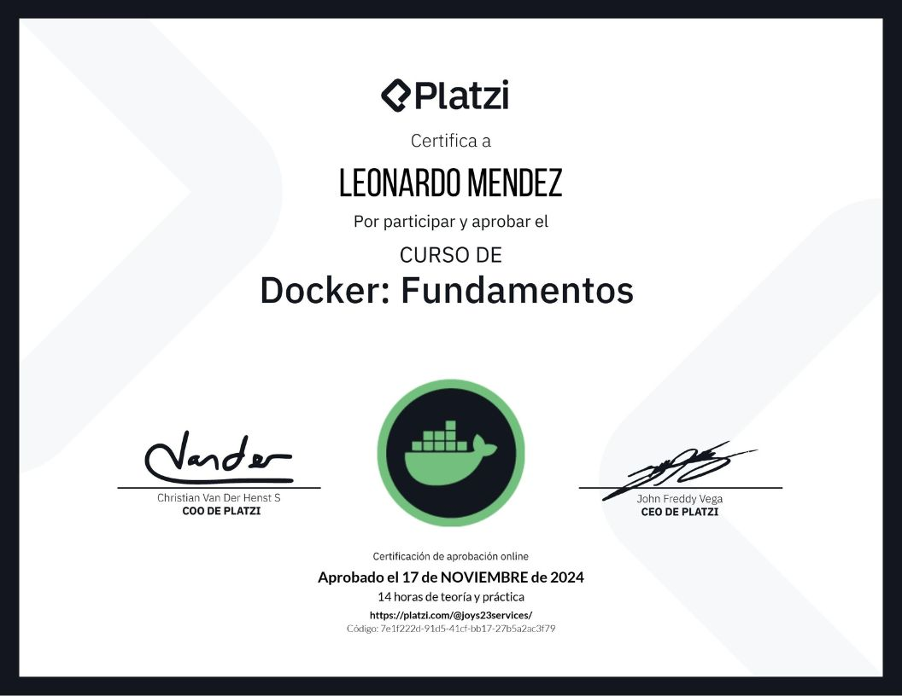

# 👋 Hi, I’m @leonardo2322  Welcome To My Github 

  

### I am a self-taught programmer I am passionate about technology at the moment I am enrolled in the National Open University (UNA) studying systems engineering and I have been learning on my own for 3 years.

#### i am from venezuela at the moment i am in merida i am 27 years old 

  

  

- 🌱 I’m currently learning flet framework of python and Django  
  
- ⚡ Fun fact: I use tabs over spaces  

-🐱‍👤I am very versatile looking for what I don't know 
  

   

## My Skill Set  
<table><tr><td valign="top" width="33%">

### Frontend  

  
  
  
  
  
  
  
  

</td><td valign="top" width="33%">

### Backend  

  
  
  
  
  
  
  
  
  
  
 

</td><td valign="top" width="33%">

### DevOps  

  
  
  
  
  

</td></tr></table>  

   

## Connect with me  

  
 

  
  

 
## Certificados

  

## Github Stats 

 

 

  

  

 ##  Mis Ultimos videos De youtube

  

<!-- BEGIN YOUTUBE-CARDS -->

<!-- END YOUTUBE-CARDS -->

  

   

  
  

   

            

 

